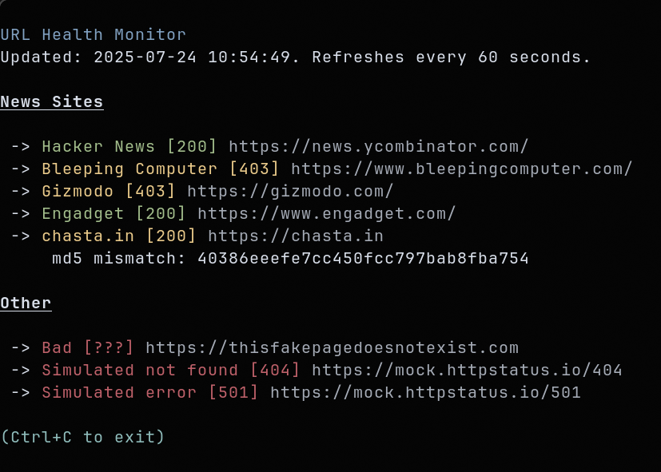

# health.py

### Simple URL health monitor for the terminal



Basic URL monitoring python script, lets you keep an eye on the response status of sites you're interested in.

By default, the script looks only at the http status codes, but it can optionally compare the page contents to an md5 hash, which is handy when the contents of the URL are known and should not change.

### Example config.json

```
{
	"refresh_seconds": 60,
	"timeout_seconds": 10,
	"data": [
    		["News Sites"],
    		["Hacker News", "https://news.ycombinator.com/"],
    		["Bleeping Computer", "https://www.bleepingcomputer.com/"],
    		["Gizmodo", "https://gizmodo.com/"],
    		["Engadget", "https://www.engadget.com/"],
    		["chasta.in", "https://chasta.in", "40386eeefe7cc450fcc797bab8fba754"],
	    	["Other"],
	        ["Bad", "https://thisfakepagedoesnotexist.com"],
    		["Simulated not found", "https://mock.httpstatus.io/404"],
	    	["Simulated error", "https://mock.httpstatus.io/501"]
	]
}
```
**refresh_seconds** The number of seconds before this code reruns and retests everything.

**timeout_seconds** The number of seconds we want to wait after a request for a response.

**data** Array of urls to monitor.

Note: "News Sites" and "Other" in this example are just report headings, they're optional, but a nice way to group the URLs in the terminal when showing the report.They can be any descriptive string you want. The script knows its a header because there's no URL specified.

The other entries represent URLs to monitor. The first column is the name for reporting purposes, the second obviously is the URL you want to monitor, and the third (optional) is an md5 hash of the contents of the page which enables comparing the current contents of the page with a known good version of the contents.

If you want to compare the md5 hash but don't have it, just enter a fake value and save it, then run the code and the report will show you the current md5 hash which you can then just copy over the fake value.

